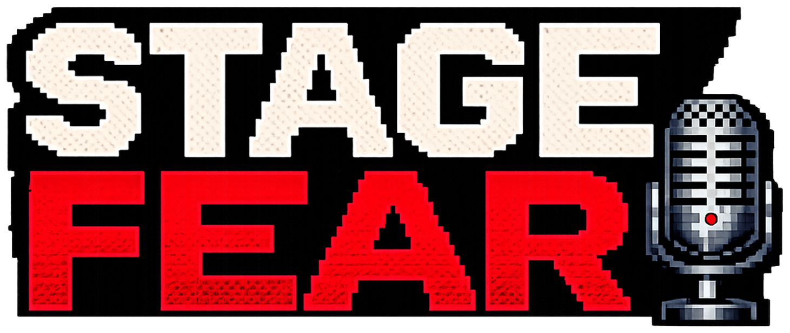

<p align="center">
  
</p>

# Stage Fear

Stage Fear is a voice-powered public speaking practice game. You choose a pixel-art speaker, enter the topic you want to practice, walk onto a virtual stage, and try to keep going while six AI hecklers interrupt with contextual spoken reactions.

The goal is not to humiliate the speaker. The goal is to make practice feel alive. Instead of rehearsing into silence, you get a noisy room, pressure, interruptions, recovery moments, and a reason to keep talking.

## What It Does

- Runs a pixel-art stage experience in the browser.
- Captures live microphone audio while the speaker practices.
- Uses speech-to-text to understand what the speaker is saying.
- Uses an LLM to generate short, topic-aware heckles from different audience personas.
- Uses ElevenLabs text-to-speech to voice the hecklers.
- Adds crowd ambience, reactions, and sound effects for a game-like practice loop.
- Prewarms early heckle audio so the first interruptions feel faster.

## The Hecklers

The audience has six personalities:

- **Skeptic**: questions assumptions and asks for proof.
- **Bored Teen**: dismisses stale ideas and overhyped trends.
- **Know-It-All**: interrupts with technical or business corrections.
- **Classic Heckler**: lands quick crowd-work punchlines.
- **Nervous One**: projects anxiety and worries about what could go wrong.
- **Critic**: points out flaws in logic, market, or positioning.

## Running Locally

You need:

- Node.js 22+
- Python 3.12+
- MongoDB
- ElevenLabs API key
- OpenRouter API key

### 1. Clone and install

```bash
git clone https://github.com/ummeeds/stage-fear.git
cd stage-fear
```

Install frontend dependencies:

```bash
cd frontend
npm install
cd ..
```

Install backend dependencies:

```bash
cd backend
python3 -m venv .venv
source .venv/bin/activate
pip install -r requirements.txt
cd ..
```

### 2. Start MongoDB

Using Docker:

```bash
docker run --name stage-fear-mongo -p 27017:27017 -d mongo:7
```

If you already have MongoDB running locally, you can skip this.

### 3. Configure backend environment

Create `backend/.env`:

```bash
cp .env.backend.example backend/.env
```

Fill in:

```env
ELEVENLABS_API_KEY=your_elevenlabs_key
OPENROUTER_API_KEY=your_openrouter_key
OPENROUTER_BASE_URL=https://openrouter.ai/api/v1
LLM_MODEL=moonshotai/kimi-k2.6
MONGO_URI=mongodb://localhost:27017
DB_NAME=stage-fear
ALLOWED_ORIGINS=http://localhost:3005
ALLOWED_HOSTS=localhost,127.0.0.1
```

Do not commit real `.env` files.

### 4. Run the backend

```bash
cd backend
source .venv/bin/activate
python3 -m uvicorn main:app --host 127.0.0.1 --port 8010
```

Health check:

```bash
curl http://127.0.0.1:8010/api/health
```

### 5. Run the frontend

In a second terminal:

```bash
cd frontend
NEXT_PUBLIC_API_URL=http://127.0.0.1:8010 \
NEXT_PUBLIC_WS_URL=ws://127.0.0.1:8010 \
npm run dev
```

Open:

```text
http://localhost:3005
```

For microphone access in production, use HTTPS. Localhost is allowed by browsers for development.

## Docker Deployment

The repo includes `docker-compose.stagefear.yml` for VPS deployment behind a reverse proxy such as Traefik.

Required server-side env:

```env
STAGEFEAR_HOST=your-domain.com
STAGEFEAR_BASE_PATH=/stage-fear
```

Required backend env file:

```env
ELEVENLABS_API_KEY=your_elevenlabs_key
OPENROUTER_API_KEY=your_openrouter_key
OPENROUTER_BASE_URL=https://openrouter.ai/api/v1
LLM_MODEL=moonshotai/kimi-k2.6
```

Deploy:

```bash
docker compose --env-file .env -f docker-compose.stagefear.yml up -d --build
```

## Architecture

```text
Browser
  |
  | Next.js frontend
  | - menu, stage UI, Phaser renderer
  | - microphone capture
  | - websocket audio streaming
  v
FastAPI backend
  |
  | - session API
  | - websocket audio ingestion
  | - speech filtering
  | - heckle timing and persona rotation
  | - early heckle audio warmup
  |
  +--> ElevenLabs
  |    - speech-to-text
  |    - text-to-speech
  |    - sound effects
  |
  +--> OpenRouter / LLM
  |    - topic-aware heckle generation
  |    - crowd-work generation
  |
  +--> MongoDB
       - sessions
       - transcripts
       - heckle history
```

## Project Structure

```text
backend/
  main.py                     FastAPI routes and websocket loop
  models.py                   Session, theme, and heckler models
  services/
    elevenlabs_service.py     STT, TTS, and sound generation
    llm_service.py            Prompting, persona choice, heckle generation
    session_service.py        MongoDB persistence

frontend/
  app/                        Next.js app routes and UI
  components/StageGame.tsx    Phaser stage renderer
  lib/                        API and asset path helpers
  public/                     Logo, sprites, and sound assets

docker-compose.stagefear.yml  Production compose stack
```

## Credits

Built by [@ummeed_dev](https://x.com/ummeed_dev).

Music: Ummeed with ElevenLabs  
Sound Effects: Ummeed with ElevenLabs

## A Note For Anyone Afraid Of The Stage

If speaking in front of people makes your chest tighten, your voice shake, or your thoughts disappear, you are not broken. You are standing at the edge of something vulnerable: being seen while trying to say something that matters.

Stage Fear is built for that moment. Not to make fear vanish, but to help you practice staying with yourself while the room feels loud. Every shaky sentence is still a sentence. Every recovery is evidence. With enough practice, the noise gets less powerful, and your own voice gets easier to find.

You deserve to say what you actually came to say.
